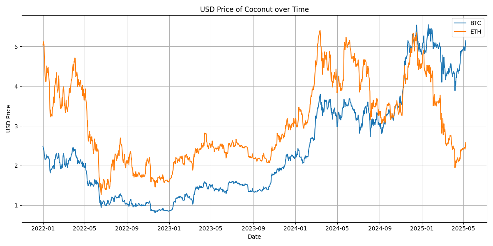

# Coconut price estimator

This script retrieves the best guess of the coconut price in USD, given a set of prices in some crypto currencies.

## Installation

Use the package manager [pip](https://pip.pypa.io/en/stable/) to install the required packages:

```bash
pip install numpy pandas websocket certifi ssl datetime matplotlib
```

## Usage

From the root directory, run main.py. 
The console will output the following:

```console
On 2024-10-03 we observe the minimum distance between the price of the coconut in USD calculated using ETH and BTC 
exchange rates, corresponding to a difference of 0.0025 USD.
On 2024-10-03 the price in USD calculated using the ETH-USD rate is 3.1848 USD while the price in USD calculated 
using the BTC-USD rate is 3.1824 USD.
```

Moreover, it will create the following plot



## Key Assumptions

The key thought is to understand that, given the same day, the price in USD of the coconut must be the same when 
calculated using corresponding exchange rate for any given coin. Therefore, we must look for a specific date in which
the difference between the USD prices is minimum. We retrieve the historical coin prices in USD from Deribit settlement
PERPS prices. We do not require additional coins other than BTC and ETH, since the calculated minimum difference is less 
than 0.005 USD, which satisfy the accuracy request.
In conclusion, the price of the coconut is 3.18 USD, and the image was created on 2024-10-03.